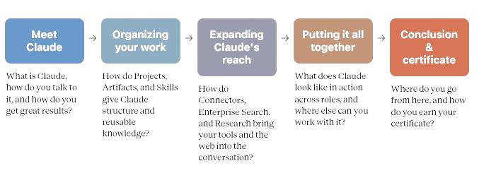

# Claude 101

An introduction to Anthropic's Claude ecosystem, covering the fundamentals of working effectively with Claude as an AI thinking partner.

---

## Course Overview

Claude 101 introduces the core concepts behind Claude, its capabilities, and the tools that enable productive AI collaboration. The course focuses on developing practical skills for communicating with Claude, organizing work, expanding its capabilities, and applying it effectively in real-world scenarios.

---

## Course Roadmap



| Module | Focus |
|---------|-------|
| **Module 1** | Meet Claude |
| **Module 2** | Organizing Your Work |
| **Module 3** | Expanding Claude's Reach |
| **Module 4** | Putting It All Together |
| **Module 5** | Conclusion & Certificate |

---

## Learning Objectives

After completing this course, you should be able to:

- Explain what Claude is and how it differs from traditional chatbots.
- Communicate effectively with Claude using conversational prompting.
- Organize long-term work using Projects, Artifacts, and Skills.
- Extend Claude through Connectors, Research, and Enterprise Search.
- Apply Claude to real-world professional workflows.
- Evaluate Claude's strengths and limitations for recurring tasks.

---

## Repository Structure

```
Claude 101/
├── README.md
├── images/
├── 01 - Meet Claude.md
├── 02 - Organizing your work.md
├── 03 - Expanding Claude's reach.md
├── 04 - Putting it all together.md
├── 05 - Conclusion.md
```

---

## Documentation Standards

Each lesson should include:

- Summary
- Key Concepts
- Important Takeaways
- Practical Examples
- Lumetis Applications
- Personal Insights
- Follow-up Experiments

The objective is not simply to restate the course content, but to document practical knowledge that can be reused in consulting, software engineering, AI implementation, and future training.

---

## Knowledge Categories

### 📚 Modules

Detailed notes and summaries for each lesson.

### 💬 Prompts

Useful prompts discovered throughout the course.

### ⚙️ Workflows

Repeatable Claude workflows that can be applied in real projects.

### 🧪 Experiments

Independent testing, observations, and comparisons beyond the course material.

### 📖 Resources

Reference material, links, screenshots, and supporting documentation.

---

## Certification Goals

This repository aims to go beyond earning a certificate by creating a reusable knowledge base that:

- Documents practical applications.
- Captures implementation ideas.
- Records experiments and lessons learned.
- Builds reusable workflows.
- Serves as future training material for Lumetis.

---

## Progress

| Module | Status |
|---------|--------|
| Meet Claude | ⬜ |
| Organizing Your Work | ⬜ |
| Expanding Claude's Reach | ⬜ |
| Putting It All Together | ⬜ |
| Conclusion & Certificate | ⬜ |

---

## Guiding Philosophy

> Don't collect certificates.
>
> Build knowledge.
>
> Test ideas.
>
> Create systems.
>
> Share what works.
